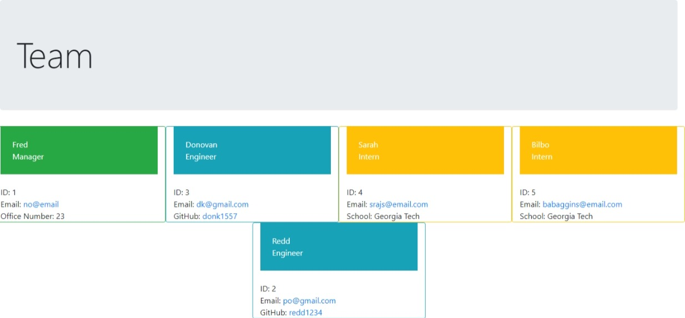

# team-profile-generator
  (http://perso.crans.org/besson/LICENSE.html)
  ## Description
    This program generates an HTML file based on credentials provided by the user about their team's profile. The HTML will have a card for each position: the manager's in green, engineers' in blue, and interns' in yellow. You can click on individual's emails and it will open default email service with individual's email in the TO field. You can click on individual's GitHub info and it will link to that person's GitHub repo. Once created, the HTML file will be found in the src folder.
  ## Installation Instructions
    Uses Inquirer and Jest as dependencies. The HTML file has Bootstrap CDN in the head section.
  ## Usage Information
    Answer prompts (in node) about the manager; there can only be one manager for this team creator. Add multiple engineers or interns and type inputs for their credentials. When finished, hit enter on Finish Team Building and an HTML, called `test.html`, with the input information will be generated in the src folder. If you want to try it out for yourself, be sure to delete `test.html` from the src folder.

  ## Test Instructions
    Run `npm test` in the terminal to test the different classes in the lib folder.

  ## Questions
  Github profile link: https://github.com/donk1557

  Generated HTML Page: 

  Video outlining usage: https://drive.google.com/file/d/1zZcjaHc3tRwi6KPoyBCq5bJ-33jzV75Q/view
 